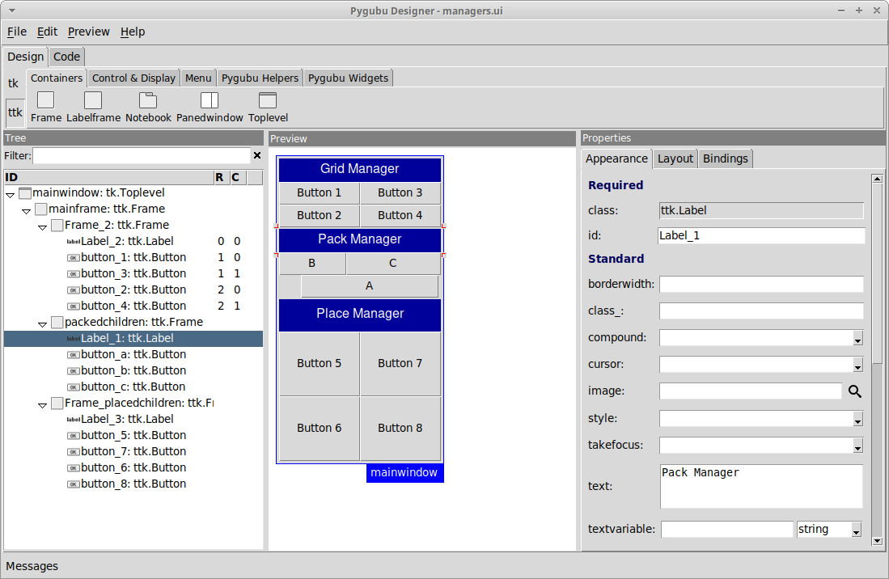

Bienvenido a Pygubu!
====================

Pygubu es una [herramienta RAD](https://es.wikipedia.org/wiki/Desarrollo_r%C3%A1pido_de_aplicaciones) que permite _desarrollar interfaces de usuario rápida y fácilmente_ para el modulo tkinter de Python.

La interfaces diseñadas se guardan como archivos [XML](https://es.wikipedia.org/wiki/Extensible_Markup_Language), y usando el _constructor de pygubu_ estos pueden ser cargados dinámicamente por las aplicaciones
a medida que lo necesiten.

Pygubu esta inspirado por [Glade](https://es.wikipedia.org/wiki/Glade) (el diseñador de interfaces de gtk).

Instalación
============

La última versión de pygubu requiere Python >= 3.6

Puedes instalar pygubu-designer usando:

### pip:

```
pip install pygubu-designer
```

Captura de pantalla
===================




Modo de uso
===========

Ejecuta el diseñador ejecutando en una consola los siguientes comandos, 
dependiendo del sistema operativo que uses.

### Sistemas tipo Unix:

```
pygubu-designer
```

### Windows:

```
c:\Python3\Scripts\pygubu-designer.exe
```

Donde 'c:\Python3' es **tu** directorio de instalación de python.

Ahora, puedes comenzar a crear tu aplicación tkinter usando los widgets que
encontrarás en el panel superior denominado `Paleta de widgets`.

Luego de finalizar la creación de tu _interface de usuario_, grábala en un
archivo`.ui` con la opción `Archivo > Guardar` del menu principal.

El siguiente es un ejemplo de interfaz de usuario denominado
[holamundo.ui](examples/helloworld/holamundo.ui) creado usando pygubu-designer:

```xml
<?xml version='1.0' encoding='utf-8'?>
<interface version="1.2">
  <object class="tk.Toplevel" id="mainwindow">
    <property name="height">200</property>
    <property name="resizable">both</property>
    <property name="title" translatable="yes">Hola Mundo App</property>
    <property name="width">200</property>
    <child>
      <object class="ttk.Frame" id="mainframe">
        <property name="height">200</property>
        <property name="padding">20</property>
        <property name="width">200</property>
        <layout manager="pack">
          <property name="expand">true</property>
          <property name="side">top</property>
        </layout>
        <child>
          <object class="ttk.Label" id="label1">
            <property name="anchor">center</property>
            <property name="font">Helvetica 26</property>
            <property name="foreground">#0000b8</property>
            <property name="text" translatable="yes">Hola Mundo !</property>
            <layout manager="pack">
              <property name="side">top</property>
            </layout>
          </object>
        </child>
      </object>
    </child>
  </object>
</interface>
```

Luego, crea tu _aplicación_ como se muestra a continuación 
([holamundo.py](examples/helloworld/holamundo.py)):

```python
# helloworld.py
import pathlib
import pygubu

PROJECT_PATH = pathlib.Path(__file__).parent
PROJECT_UI = PROJECT_PATH / "holamundo.ui"


class HolamundoApp:
    def __init__(self, master=None):
        # 1: Crear un builder y configurar el path de recursos (si usas imágenes)
        self.builder = builder = pygubu.Builder()
        builder.add_resource_path(PROJECT_PATH)

        # 2: Cargar un archivo UI
        builder.add_from_file(PROJECT_UI)

        # 3: Crear la ventana principal
        self.mainwindow = builder.get_object("mainwindow", master)

        # 4: Conectar callbacks
        builder.connect_callbacks(self)

    def run(self):
        self.mainwindow.mainloop()


if __name__ == "__main__":
    app = HolamundoApp()
    app.run()
```

Ten en cuenta que en lugar de `holamundo.ui` en la línea:

```python
builder.add_from_file('holamundo.ui')
```

Debes insertar el _nombre de archivo_ (o path) de la interfaz de usuario
que acabas de grabar.


Ten en cuenta además que en lugar de `'mainwindow'` en la línea:

```python
self.mainwindow = builder.get_object('mainwindow')
```

Debes tener el nombre del _widget principal_ (el padre de todos los widgets), 
en caso contrario obtendras un error similar al siguiente::

    Exception: Widget not defined.

Mira [este](https://github.com/alejandroautalan/pygubu/issues/40) issue 
para mayor información.


Documentación
=============

Visita la [wiki](https://github.com/alejandroautalan/pygubu-designer/wiki) para
mas documentación.

Los siguientes links son buenas referencias (en inglés) de tkinter (y tk):

- [TkDocs](http://www.tkdocs.com)
- [Graphical User Interfaces with Tk](https://docs.python.org/3/library/tk.html)
- [Tkinter 8.5 reference: a GUI for Python](https://tkdocs.com/shipman)
- [An Introduction to Tkinter](http://effbot.org/tkinterbook) [(archive)](http://web.archive.org/web/20200504141939/http://www.effbot.org/tkinterbook)
- [Tcl/Tk 8.5 Manual](http://www.tcl.tk/man/tcl8.5/)

Tambien puedes buscar en el directorio de [ejemplos](examples) o mirar este 
ejemplo de 'Hola mundo' en
[vídeo](http://youtu.be/wuzV9P8geDg)


Historia
========

Mira la lista de cambios [aquí](HISTORY.md)
